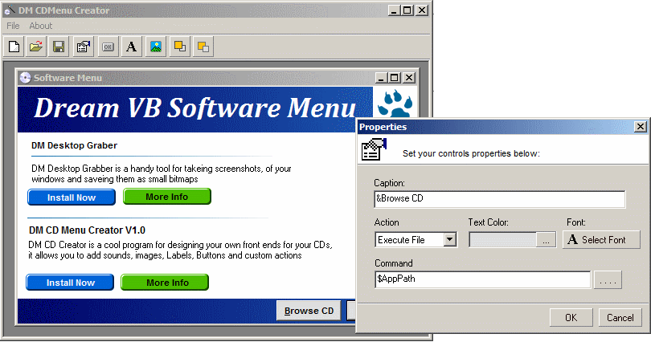



## CDMenu Creator

### Description

Hi, DM CDCreator is a small program I made for makeing Fontends for my CDs comes with an easy to use Visual Designer, you can add images, lables and buttons with actions like opening files or showing message boxes, anyway I hope you like this first version see screen shot for more, Please vote if you like this code.
 
### More Info
 

             |
---                |---
**Submitted On**   |2008-11-02 22:03:28
**By**             |[dreamvb](https://github.com/Planet-Source-Code/PSCIndex/blob/master/ByAuthor/dreamvb.md)
**Level**          |Intermediate
**User Rating**    |4.7 (14 globes from 3 users)
**Compatibility**  |VB 6\.0
**Category**       |[Complete Applications](https://github.com/Planet-Source-Code/PSCIndex/blob/master/ByCategory/complete-applications__1-27.md)
**World**          |[Visual Basic](https://github.com/Planet-Source-Code/PSCIndex/blob/master/ByWorld/visual-basic.md)
**Archive File**   |[CDMenu\_Cre2133091132008\.zip](https://github.com/Planet-Source-Code/dreamvb-cdmenu-creator__1-71354/archive/master.zip)

